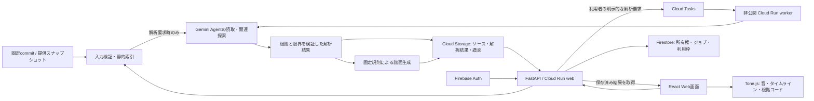

# Code Groove

コードの責務と処理の関係を、音・タイムライン・ソース表示でたどる開発支援ツールです。

[PRリハーサルの公開デモ](https://code-groove-rehearsal-2026.kouduki.chatgpt.site) · [音の規則](docs/SONIFICATION.md) · [ドキュメント](docs/README.md)


## PRリハーサル

[Code Groove](https://github.com/kdoai/code-groove)、[SoundCoding2026](https://github.com/kouduki1101/SoundCoding2026)、[Codelody](https://github.com/yuki-kobayashi-git/codelody) の発想を、レビュー担当者の一連の行動にまとめた画面です。Code Grooveの根拠付き意味譜面を土台に、SoundCoding2026の「関数が呼び、相手が応え、結果を受け取る」演奏と、Codelodyの音に同期するコード行・行から音への移動を組み合わせています。

開始画面からサンプルを開き、Web返品か店舗返品を選び、変更前→変更後を約20秒で聴き比べます。右側のコードは演奏段階に合わせて切り替わります。最後に仕様やテストで確かめたい問いを残し、Markdownとしてコピーできます。音は静的に確認できた構造をたどる手がかりで、品質や正誤の判定ではありません。

公開用の保存済みデモは `pnpm build:static` で `out/` に生成し、`pnpm preview:static` で確認できます。新しい解析は行わず、保存済みのGemini解析を表示します。ライブ版では公開GitHub PRのURLを受け取り、その時点のheadを固定SHAで解析します。PR差分の自動判定やmerge-base比較は行いません。ライブ版には下記のAPI、認証、Google Cloudの設定が必要です。[体験設計と制約](docs/PR_REHEARSAL.md)

## 概要 / Overview

既存コードやAI生成コードを引き継ぐ開発者・レビュアーは、処理がどこに分散し、どの責務が繰り返され、何を根拠に判断できるかを読み解く必要があります。ファイルを順に読むだけでは、関連する実装や設計上の例外を見落としやすく、理解とレビューの説明にも負担がかかります。

### 提供する解決策

Gemini Agentが関連するコードを読み、責務・意味イベント・判断の根拠を整理します。固定規則でその結果を旋律とタイムラインへ変換し、気になった音や確認候補から根拠コードへ戻れます。利用者は二つの実装を比較し、別の説明や未確認事項を確かめて判断します。

同じ責務には同じ旋律を使い、分散・繰り返し・交互の現れ方・間隔を探索の手がかりにします。音の違いや反証の確認だけで、欠陥・深刻度・品質を判定しません。観察、Agentの解釈、人の判断を区別し、未調査を「問題なし」と扱いません。

### 期待される効果

**定量的効果:** 読解時間やレビュー工数の改善は未計測です。理解に要する時間、気になった音から根拠へ到達する時間、比較した違いを説明できた割合を評価指標とします。技術テストの成功は、読解の効果やAgentの解釈精度の証明ではありません。

**定性的効果:** 同じ責務が現れる場所を見渡し、コードに戻って理由を説明できます。比較メモ・根拠範囲・未確認事項を共有することで、レビューや引き継ぎ時の認識を揃える助けになります。音なしでも根拠を読めます。

## アーキテクチャ・技術スタック



解析対象のコードを実行せず、信頼済みパーサーで静的に読み取ります。保存済み結果の閲覧・再生・静的な構造比較ではモデルを呼び出しません。

| 領域 | 技術と役割 |
|---|---|
| Web | React、TypeScript、Vite、Monaco Editor、Zustand、TanStack Query |
| 再生・譜面 | Tone.js、独自の決定的な譜面変換、共有の音源キット |
| API・静的解析 | Python 3.13、FastAPI、Pydantic、Python AST、TypeScript Compiler API |
| AI Agent | Gemini、Google Gen AI SDK、Google ADKによる制限付き読取・提出 |
| 実行・保存 | Cloud Run、Cloud Tasks、Firestore、Cloud Storage、Firebase Auth |
| 検証・配備 | Vitest、pytest、Playwright、GitHub Actions、Cloud Build、Artifact Registry |

詳細は[技術構成](docs/TECHNICAL_GUIDE.md)と[動作仕様](docs/SPEC.md)を参照してください。

### AI エージェントが生み出す価値

Agentは実装一覧や静的な呼出関係を探索し、関連実装・呼び出し元・テスト・型や契約・文書を読み、責務と意味イベントの説明を組み立てます。仮説と反証の問い、読んだ行範囲と内容のhash、判断保留や前提の限界を残すため、人が説明を根拠コードまでたどれます。

追加調査では選択範囲と関連する実装を読み直し、比較した違いや別の説明を検討します。二関数への質問では初回解釈を維持・修正・保留する理由を返します。読み取っていない範囲や実行時の動作は検証済みとしません。改善案は差分で提示し、人が採用した場合だけアプリ内の新しいスナップショットへ反映します。

## 機能一覧 / Features

| 機能 | 利用方法と範囲 |
|---|---|
| 公開サンプル | ログイン不要。保存済み実解析と模擬サンプルを明示して表示 |
| 保存・再生 | 責務の旋律、ファイル順／意味ごとの配置、ソースと読取根拠の相互参照 |
| 確認候補 | 控えめな丸印から観察・解釈・別の説明の確認状態・未確認事項へ移動 |
| 集中した試聴 | 対象の意味イベントだけを最大10秒。終了・取消・エラーで元の位置と再生設定に復帰 |
| 二関数の比較 | TypeScriptの構文とコードを比較。両側に根拠付き旋律があれば同じテンポ・音量設定・小節数で試聴。対応不明を明示 |
| 呼出・返却・利用 | TypeScript／TSX・Pythonの静的な定義、return候補、限定した結果の参照を表示・試聴。上限による省略も明示 |
| 新規解析・追加調査 | ログイン後の明示操作で開始。TypeScript／TSX・Pythonに対応し、時間・トークン・利用回数を制限 |
| 改善案と人の承認 | 差分を確認して採用。元のソースを保持し、対象リポジトリへ変更やpushを行わない |
| 比較メモ | 期待・観察・疑問と人の確認状態を端末に保存し、ローカルJSONへ書き出し |

構造比較は`.ts`の限定した関数が対象です。静的な関係は実行時の流れではなく、複数のreturnから実行経路を推測しません。[比較の対象と制限](docs/STRUCTURE_COMPARISON.md)・[呼出・返却・利用の範囲](docs/CALL_RELATIONSHIPS.md)

## 使い方

1. 開始画面で「サンプルでレビューを始める」を押し、Web返品か店舗返品を選びます。
2. 「前 → 後を聴く」で関数同士のやり取りを聴き比べます。右側の根拠コードが音に合わせて切り替わります。
3. 「レビューの問い」に、仕様やテストで確かめたい点を残します。Markdownとしてコピーできます。
4. 必要なら「変更前の譜面」「変更後の譜面」へ進み、タイムライン、確認候補、保存済みAgentの説明、二関数の構造比較を詳しく調べます。

最初のデモはTsugiaiのCheckout Agentを調べた**保存済み実解析**です。確認済みなのは9実装で、コード全体や実行動作の検証ではありません。再生と閲覧にログインや新しいAI解析は不要です。[デモの対象範囲](docs/TSUGIAI_DEMO.md)

ログイン後、自分の私有コピーを保存して追加調査を依頼できます。新規解析・質問の送信・改善案の依頼にはモデルの利用が発生します。保存だけでは新しいモデル要求を開始しません。私有コピーのアクセス期限は7日です。[データの扱い](docs/data-handling.md)・[利用上限と費用](docs/cost-plan.md)

## ディレクトリ構成

```text
apps/web/             Web画面・コード表示・再生
apps/backend/         API・Agent・入力検証・ジョブ・保存
packages/groove-core/ 決定的な譜面生成
packages/repo-indexer/ TypeScriptの静的索引・構造比較・関係抽出
packages/contracts/   生成したTypeScript契約
contracts/            生成したJSON Schema
fixtures/             模擬例・保存済み実解析・同梱ライセンス
assets/audio-source/  音源の出典・ライセンス・固定hash
tests/                単体・API・ブラウザの検証
scripts/              開発起動・生成・検証・リリース
infra/                GCPとGitHubの配備設定
docs/                 仕様・使い方・開発・運用
```

## セットアップ / Getting Started

Node.js 24、pnpm 10.27.0、Python 3.13、uvが必要です。依存は`pnpm-lock.yaml`と`uv.lock`に固定しています。リポジトリのルートで実行します。既存の`.env`がある場合はコピーを省略してください。

```powershell
Copy-Item .env.example .env
pnpm install --frozen-lockfile
uv sync --locked
pnpm build:tools
```

端末1でAPIとローカルworkerを起動します。以下の設定では模擬Agentとローカル保存を使い、有料モデルを呼び出しません。

```powershell
$env:PYTHONPATH='apps/backend'
$env:ENVIRONMENT='local'
$env:APP_ROLE='web'
$env:MODEL_MODE='fixture'
$env:STORE_MODE='local'
$env:ENABLE_LIVE_ANALYSIS='false'
uv run python scripts/dev.py
```

端末2でWebを起動します。

```powershell
pnpm dev:web
```

[http://127.0.0.1:5173](http://127.0.0.1:5173)を開きます。APIは8080を使います。終了は両端末でCtrl+Cです。ブラウザテストは`pnpm exec playwright install chromium`で準備し、`pnpm test:e2e`で実行できます。その他の検証と契約生成は[開発手順](docs/DEVELOPMENT.md)を参照してください。

## 環境変数一覧

ローカルの公開サンプル閲覧は、同梱の初期値で起動できます。実解析とGCP保存は別途接続設定が必要です。`.env`と実行データの`.local/`はGit管理外です。

| 変数名 | 用途 | 必須となる条件 | サンプル値 |
|---|---|---|---|
| `ENVIRONMENT` | 実行環境 | 任意・初期値local | `local` |
| `APP_ROLE` | Web／worker | 任意・初期値web | `web` |
| `MODEL_MODE` | 模擬／実モデル | 任意・初期値fixture | `fixture` |
| `ENABLE_LIVE_ANALYSIS` | 実解析の有効化 | 実解析 | `false` |
| `GEMINI_MODEL` | 実モデルのID | 実解析・初期値あり | `gemini-3.8-flash` |
| `MODEL_AUTH_MODE` | ADC／Express認証 | 実解析・初期値adc | `adc` |
| `GOOGLE_CLOUD_PROJECT` | GCPプロジェクト | ADC実解析・GCP保存 | `example-project` |
| `GOOGLE_CLOUD_QUOTA_PROJECT` | SDKの割当プロジェクト | 接続設定に応じて | `example-project` |
| `GOOGLE_CLOUD_LOCATION` | モデルの接続先 | 実解析・初期値global | `global` |
| `GOOGLE_CLOUD_API_KEY` | Expressモードのキー | Express実解析のみ | `<YOUR_API_KEY>` |
| `GCP_REGION` | アプリのリージョン | GCP配備 | `asia-northeast1` |
| `STORE_MODE` | ローカル／GCP保存 | 任意・初期値local | `local` |
| `LOCAL_DATA_DIR` | ローカル保存先 | ローカル・初期値あり | `.local` |
| `ARTIFACT_BUCKET` | スナップショットと成果物の保存先 | GCP保存 | `example-artifacts` |
| `FIRESTORE_DATABASE` | Firestoreデータベース | GCP保存・初期値あり | `(default)` |
| `PUBLIC_BASE_URL` | Webの基準URL | 任意・初期値あり | `http://localhost:5173` |
| `WORKER_URL` | 非公開workerのURL | GCPジョブ処理 | `https://worker.example.com` |
| `TASKS_QUEUE` | Cloud Tasksキュー | GCPジョブ処理・初期値あり | `cg-analysis` |
| `TASKS_INVOKER_EMAIL` | Tasksの呼出用サービスアカウント | GCPジョブ処理 | `tasks@example-project.iam.gserviceaccount.com` |
| `FIREBASE_API_KEY` | FirebaseのWeb認証設定 | ログイン・本番Web | `<FIREBASE_WEB_API_KEY>` |
| `FIREBASE_AUTH_DOMAIN` | Firebase認証ドメイン | ログイン | `example-project.firebaseapp.com` |
| `FIREBASE_APP_ID` | Firebase WebアプリID | ログイン | `<FIREBASE_APP_ID>` |

本番の実モデル接続はADCと実行サービスアカウントを使います。認証情報は非公開の管理先で扱います。

## デプロイ / Deployment

GitHub Actionsの[CI workflow](.github/workflows/ci.yml)は、PRでコード検証とSecret scanを実行します。**mainへのpush・マージ後、両方の成功を条件に本番へ自動デプロイ**します。

Workload Identity FederationでGCPへ認証し、Cloud Buildでcommit SHAをタグにしたイメージを作成します。Artifact Registryから東京のCloud Run web・非公開workerへ同じイメージを配備し、revision・トラフィック・ヘルス・アクセス制御・公開サンプルを確認します。PRからの本番配備は行いません。

[配備workflow](.github/workflows/deploy.yml) · [CI/CDの詳細](docs/CI_CD.md) · [復旧と運用](docs/runbook.md) · [費用計画](docs/cost-plan.md)

## ライセンス / License

このリポジトリにはルートの`LICENSE`がなく、アプリ本体の包括的な再利用ライセンスは未指定です。第三者コード・音源にはそれぞれの利用条件が適用されます。

| 対象 | ライセンス・出典 |
|---|---|
| Tsugiaiの保存済みサンプル・参考ソース | MIT · [同梱ライセンス](fixtures/licenses/tsugiai-LICENSE.txt)・[参考ソースのライセンス](fixtures/repository-reference/TSUGIAI_LICENSE.txt) |
| tonejs-instrumentsのライセンス文書 | コードの条件はMIT。録音の条件は次行のCC BY 3.0 · [同梱ライセンス](assets/audio-source/LICENSE.txt) |
| 録音Bass・Piano | CC BY 3.0。Karoryfer／VSO2、編集Nicholaus P. Brosowsky。Code Grooveでモノラル化・フィルタ・正規化・長さ等を加工 · [クレジット](apps/web/public/audio/midnight-jazz-v4/NOTICE.txt) |
| Code Grooveで作成したVibes等 | 音源クレジットでMITと記載 · [音源と固定hash](assets/audio-source/sources.json) |

呼出・返却・利用の根拠をまとめる着想は[SoundCoding2026の固定版](https://github.com/kouduki1101/SoundCoding2026/tree/3261ef988c57c5be1c42e5d0ee42182542759c84)を参考にしています。コード・音源の流用はありません。依存ライブラリの条件は各配布物のライセンスを参照してください。
