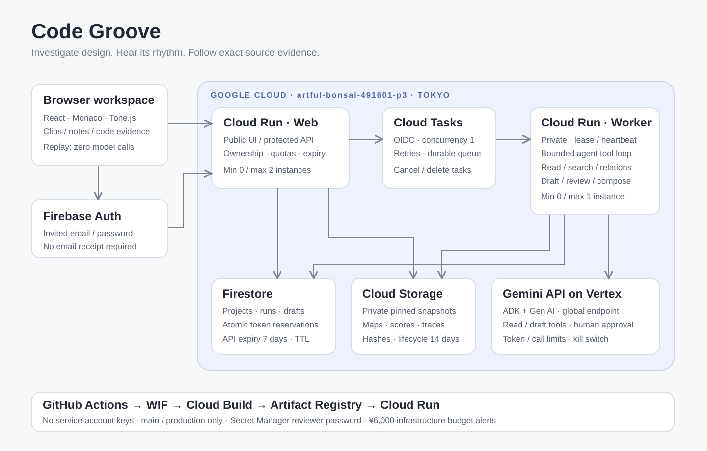

# 技術構成

Web画面はReact、TypeScript、Monaco Editor、Tone.jsで構成します。FastAPIのAPIが認証と解析要求を受け付け、Cloud Tasksを通して非公開workerへ処理を渡します。

| 領域 | 役割 |
|---|---|
| Web | コードの閲覧、演奏、根拠選択、Agentへの質問、差分の確認 |
| API | 認証、所有権、入力の検証、ジョブの作成と状態取得 |
| worker | 信頼済みパーサーによる静的索引、Geminiによる調査、根拠の検証 |
| Firestore | プロジェクト、ジョブ、実行状態、利用枠 |
| Cloud Storage | ソースのスナップショット、解析結果、譜面 |
| Firebase Auth | 利用者の認証 |

Agentはコード読取や関連探索のツールを使って調査し、根拠付きの解析結果を提出します。アプリが読取記録、出力形式、時間・トークン予算を検証します。解析対象のコードを実行するツールは提供しません。

音は解析結果を固定規則で変換して生成します。Geminiが音楽そのものを作るわけではありません。同じ解析結果・規則・音源からは同じ譜面を生成します。

ソースは固定commitのスナップショットとして保存します。改善案を採用すると別のスナップショットを作り、元のコードと解析結果は保持します。元リポジトリへの書き込みは行いません。

通信契約は`apps/backend/code_groove/schemas.py`で定義します。JSON SchemaとTypeScript型の生成方法は[開発手順](DEVELOPMENT.md)に記載しています。

[データの流れ](data-flow.svg) · [処理シーケンス](sequence.svg) · [データの扱い](data-handling.md)
